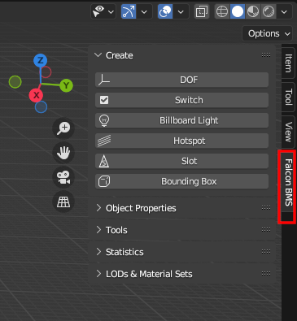

# Falcon BMS Blender Plugin


<h2 align="center">Official <a href=https://www.falcon-bms.com>Falcon BMS</a> BMLv2 plugin for Blender</h2>


---

## Supported Versions
Currently, the plugin supports [Blender 3.6 LTS](https://www.blender.org/download/lts/). Support for 4.x is in development.
The plugin requires *Falcon BMS 4.37.4* or a later version. The plugin including the DDS export & import was tested to work in **Windows** and **Linux**. **Mac** should work but is currently untested.

---

## Quickstart
### Installation / Updating
* Download the plugin [from the releases page](https://github.com/BenchmarkSims/bms-blender-plugin/releases).
* In Blender: install the plugin (Edit &rarr; Preferences &rarr; Add-ons &rarr; Install..) and enable it.
* Recommended: configure the path to the BMS Editor in the plugin preferences.
> **⚠️ You MUST completely restart Blender after each plugin update.**


### Falcon BMS Panel
Access the plugin panel from the Blender toolbar.




### BMS Specific Items
* *DOFs* - used for animations, can rotate/translate/scale their children.
* *Switches* - show/hide parts of the model.
* *BBL Lights* - billboard lights without light emission, usually used for stationary lights (e.g. airport installations).
* *Hotspots* - make parts of the model clickable, used for cockpits.
* *Slots* - slots which will allow adding dynamic parts to your model (bombs, missiles, ...).
* *Bounding Box* - a bounding box of your model.

### Exporting
* Use File &rarr; Export &rarr; F4-BMS (.bml)
* Make sure to export both the model and the *Materials.mtl* (or the BMS Editor will not load your model).

---

## Further Resources
* [MANUAL.md](docs/Manual/MANUAL.md) - the detailed manual
* [BMS Substance Painter Plugin](https://github.com/BenchmarkSims/bms-substance-plugin) - recommended to create BMLv2 compatible textures with Adobe Substance 3D Painter
* [C-17A creation in 3DSMax](https://wiki.falcon-bms.com/en/tutorials) explains how to create a complex aircraft (3ds Max specific but gives some general ideas).

---

## Contact, Reporting Issues
For general questions or feature requests, you can contact the BMS team on [Discord](https://discord.gg/KQNHQBz) or [the Forum](https://forum.falcon-bms.com/).

If you want to report an issue, please [use this projects issue tracker](https://github.com/BenchmarkSims/bms-blender-plugin/issues) and provide the following details:

* The versions of the plugin (displayed in the Blender preferences), your Blender version and the Falcon BMS version.
* The full Blender text output (see [how to launch Blender from the command line](https://docs.blender.org/manual/en/latest/advanced/command_line/launch/index.html#command-line-launch-index)).
* A .blend file which helps us with reproducing an issue (minimal examples are preferred to full models).
* Exact steps which lead to the issue (written, a video, ...).
* If your model crashes the ```Editor.exe```: the relevant ```_xlog.txt```, ```_crash.txt``` and ```_crash.dmp``` from your ```<Your Falcon BMS Directory>/User/Logs```.

---

## Plugin Data
The Plugin uses a number of XML files for IDs (vic. "numbers") which is read by the BMS engine. Since the files are shared with the 3D Studio Max Exporter, their format should be kept compatible.
All files are located in the folder ``bms_blender_plugin/common``.

| File name     | Purpose                                            |
|---------------|----------------------------------------------------|
| callbacks.xml | List of BMS Callbacks for cockpit Hotspots         |
| DOF.xml       | List of BMS DOF names and their unique DOF numbers |
| script.xml    | List of BMS Script names and their numbers         |
| switch.xml    | List of BMS Switches and their numbers             | 

These files are currently maintained in collaboration with the BMS code team. Any incorrect, outdated or missing items should be brought forward to public channels so that fixes can be incorporated to all platforms.
A small tool to demonstrate a way to sync the ``callbacks.xml`` is located in ``util/callbacks.py``. 

---

## Development
* Build Blender as a Python module (see https://wiki.blender.org/wiki/Building_Blender/Other/BlenderAsPyModule ).
* As an IDE, PyCharm + [Blend-Charm](https://github.com/BlackStartx/PyCharm-Blender-Plugin) works pretty well.
* Refer to the ```test.py``` on how to use the plugin in a Python environment.
* To build the plugin, simply add the source folder ```bms_blender_plugin``` to  a ZIP archive. The version can be changed by setting it in the root ```__init__.py```.

---

## License
This project is published under the [MIT License](LICENSE.md).
For DDS export and import, this plugin uses parts of the [Blender DDS Addon](https://github.com/matyalatte/Blender-DDS-Addon).