# Falcon BMS Blender Plugin - Manual

### Contact: [Official BMS Website](https://www.falcon-bms.com/), [Discord](https://discord.gg/KQNHQBz), [Forum](https://forum.falcon-bms.com/). 

---

## Table of Contents
- [0. Preamble and Design Philosophy](#0-preamble-and-design-philosophy)
- [1. Installation](#1-installation)
  * [1.1. Compatibility](#11-compatibility)
  * [1.2. Troubleshooting](#12-troubleshooting)
- [2. Configuration](#2-configuration)
  * [2.1. Addon Settings](#21-addon-settings)
  * [2.2. Debug Settings](#22-debug-settings)
- [3. Modeling for Falcon BMS](#3-modeling-for-falcon-bms)
  * [3.1. Basic Concepts and their Blender Representations](#31-basic-concepts-and-their-blender-representations)
  * [3.2. Structure of a Falcon BMS 3D model](#32-structure-of-a-falcon-bms-3d-model)
  * [3.3. Object Limitations](#33-object-limitations)
- [4. UI Basics](#4-ui-basics)
- [5. Materials and Textures](#5-materials-and-textures)
  * [5.1 Basics](#51-basics)
  * [5.1.1 Importing Material Files and DDS Textures](#511-importing-material-files-and-dds-textures)
  * [5.2 Material Sets](#52-material-sets)
- [6. DOFs](#6-dofs)
    + [6.1. DOF Types](#61-dof-types)
    + [6.2. Configuring DOF Properties](#62-configuring-dof-properties)
    + [6.3. Custom Gizmos](#63-custom-gizmos)
    + [6.4. Keyframing DOFs](#64-keyframing-dofs)
- [7. Switches](#7-switches)
- [8. Billboard Lights](#8-billboard-lights)
- [9. Cockpit Hotspots](#9-cockpit-hotspots)
- [10. Slots](#10-slots)
- [11. Bounding Box](#11-bounding-box)
- [12. Render Controls](#12-render-controls)
- [13. Exporting](#13-exporting)
  * [13.1. Exported Objects](#131-exported-objects)
  * [13.2. Automatic Unit Conversion](#132-automatic-unit-conversion)
  * [13.3. Exporting a Single Collection](#133-exporting-a-single-collection)
  * [13.4. Exporting LODs](#134-exporting-lods)
- [14. Troubleshooting & Common Issues](#14-troubleshooting---common-issues)
  * [14.1 BMS Editor crashing / not opening](#141-bms-editor-crashing-or-not-opening)
  * [14.2 Weird Normals / Triangulation](#142-weird-normals-or-triangulation)
  * [14.3 BMS Crashing](#143-bms-crashing)

---

## 0. Preamble and Design Philosophy
While Falcon BMS has seen numerous updates to its rendering engine, most of its building blocks have been around since the original Falcon 4.0.
Many improvements over the original Falcon have been incorporated into the BMLv2 format, namely Physics Based Rendering, versioning of BML nodes, additional DOFs, etc.
However, keeping the compatibility between the engine and the legacy models is paramount. A consequence of this fact is the DOF-based animation system which might feel very unusual compared to more modern implementations.
Additionally, many design aspects of BML models are spread between multiple files, often with the implicit expectation of designers editing them manually in the design process.

Keeping the balance of using a modern modelling software and not breaking BMS internals is the most difficult task in developing this Plugin.
Therefore, the Plugin follows six central principles which should be observed while continuing all future work:

> 🔴 Principle #1: **The .blend file is the only source of truth.**
>
> Considering the complexity of creating a BMS model, it is important to have a single file which stores all necessary information. This includes the model itself, all textures and material data, the export configuration including the LODs, etc.
> It is recommended for designers to [pack all their textures to the .blend files](https://docs.blender.org/manual/en/latest/files/blend/packed_data.html).
> 
> Designers should consider that BMS is a group effort and that others might have to adapt/continue their work.

> 🔴 Principle #2: **The Plugin must allow for repeatable, one-click exports.**
> 
> It follows from principle #1 that if the .blend file contains all data, it has to produce a fully usable model by just triggering its export. Moreover, the export must be automatable in order to run as a batch job, as part of a CI, etc.

> 🔴 Principle #3: **The Plugin must not change BMS itself, but it must map BMS-specific objects to Blender objects.**
>
> It is important to stress that the Blender Plugin is not the only tool around: for many years, all models have been built using 3ds Max and its plugin. Any change to BMS itself must therefore never break the 3ds Max plugin or any of its models.
> 
> On the other hand, it will greatly benefit designers which are accustomed to Blender and its workflows to "translate" BMS objects to Blender objects. One example is the BMS Hitbox, which is implemented as a Blender Empty.

> 🔴 Principle #4: **The Plugin must automate as many tasks as possible and hide BMS internals when able.**
>
> When comparing this Plugin to the 3ds Max plugin, many manual tasks have been hidden from the designer and are automated internally. Examples for this include the DOF scratch variables, automated unit conversions and the calculation of the Hitbox and model radius.

> 🔴 Principle #5: **The Plugin must display correct previews wherever possible.**
>
> The legacy design process required designers to export their models often and check their results in the BMS Editor. This was especially the case for DOF animations.
> Very much work has been put into this Plugin to reproduce the behaviour of the BMS engine as faithfully as possible when using DOFs and Render Controls.
> 
> The recreation of the PBR and BMS shaders is more difficult and will require some time to be accurate.

> 🔴 Principle #6: **The Plugin must be Open Source.**
>
> The need for this principle is evident, especially when considering how long Falcon 4.0 and BMS have been around. It is expected for all maintainers to keep this plugin current, free and open.

## 1. Installation
After downloading the latest release from the [Release Page](https://github.com/BenchmarkSims/bms-blender-plugin/releases), Open Blender, Go to Edit &rarr; Preferences &rarr; Add-ons &rarr; Install, and select the zip file downloaded from the git.
This operation will install the BMS Exporter into Blender.
Updating the exporter is done the same way. When updating there is no need to remove the old version, as Blender overwrites any files changed by the installation.

> **⚠️ You MUST restart Blender after each plugin update.**.

### 1.1. Compatibility
The Blender BMS Exporter was tested with **Blender 3.6 LTS**, but is expected to work in older versions.
The Blender BMS Exporter will only work for exporting models to **Falcon BMS 4.37.4** and above.
Earlier versions of Falcon BMS are not supported by the exporter, as the .LOD model format being used has been deprecated and no longer in use.

The BMS Plugin supports **Windows**, **Linux** and should work with **Mac** (untested). This includes the DDS texture export.

### 1.2. Troubleshooting
If you want to report an issue, please [use this projects issue tracker](https://github.com/BenchmarkSims/bms-blender-plugin/issues) and provide the following details:

* The versions of the plugin (displayed in the Blender preferences), your Blender version and the Falcon BMS version.
* The full Blender text output (see [how to launch Blender from the command line](https://docs.blender.org/manual/en/latest/advanced/command_line/launch/index.html#command-line-launch-index)).
* A .blend file which helps us with reproducing an issue (minimal examples are preferred to full models).
* Exact steps which lead to the issue (written, a video, ...).
* If your model crashes the ```Editor.exe```: the relevant ```_xlog.txt```, ```_crash.txt``` and ```_crash.dmp``` from your ```<Your Falcon BMS Directory>/User/Logs```.


## 2. Configuration
Addon settings are accessed by Edit &rarr; Preferences &rarr; Add-ons &rarr; "Import-Export: Falcon BMS Plugin"


### 2.1. Addon Settings
- *BMS Editor Path* - in order for the model viewer to open after export, Falcon's ```Editor.exe``` path must be set here. The ```Editor.exe``` is located in the Falcon BMS install folder under ```<Your Falcon BMS Directory>/Bin/x64/```
- *Alternative 'Copy to Clipboard' command* - Provide an alternative command which accepts a text string and copies it to your systems keyboard. This is especially useful in Linux (e.g. ```xclip```, ```xsel -b```).
- *DOF Display* - Specify how the plugin should display the DOF types. *Apply to all DOFs* applies the settings to all DOFs in the scene.


### 2.2. Debug Settings
>  ⚠️ All debug settings are OFF by default. Enabling debug settings may lead to issues in the Blender file and in the exported BML file.
- *Do not delete export collection* - The export collection will not be deleted, showing the objects in the same configuration as they are getting exported. This is helpful while identifying exporter issues.
- *Do not join same materials* - Keeps objects with same materials separated (By default objects with same materials are merged in order to reduce number of draw calls.)

## 3. Modeling for Falcon BMS
Since Falcon BMS 4.37.4, a new 3D model format has been introduced - *BML v2*. This format allows Benchmark Sims and independent artists to create very appealing and realistic looking 3D models using PBR (Physically Based Rendering) to be integrated into the Falcon world.

Since the .LOD model format has been removed from Falcon, pTypes are no longer a concern in the BML workflow. any changes to the surface of models, like opacity, color and emission are done by textures and material files.

### 3.1. Basic Concepts and their Blender Representations
A model in Falcon BMS consists of basic building blocks. It is important to understand those in order to work with the plugin:

| Name                       | Used for                                                                                                                                                          | Representation in Blender                                                                    |
|----------------------------|-------------------------------------------------------------------------------------------------------------------------------------------------------------------|----------------------------------------------------------------------------------------------|
| DOF (Degree of Freedom)    | Animating parts of the model                                                                                                                                      | Blender "Empty" with custom data. Children will be animated.                                 |
| Switch                     | Displaying / Hiding parts of the model                                                                                                                            | Blender "Empty" with custom data. Children will be affected by the switch.                   |
| Billboard Light            | Displaying static lights which are rendered as Billboards(e.g. lights on the Tarmac)                                                                              | Blender 2D Plane with material and color                                                     |
| Hotspot                    | Clickable area in a cockpit which will emit callbacks in the BMS code (e.g. a cockpit switch)                                                                     | Blender "Empty" with custom data. No children.                                               |
| Slot                       | Part of the model which represents a droppable weapon slot (e.g. a pylon under a wing)                                                                            | Blender "Empty" with custom data. Children will be affected by changes in the Slot.          |
| Bounding Box               | The models bounding box in the Parent.dat                                                                                                                         | Blender "Empty" with custom data, only one per Model. Only its coordinates will be exported. |
| Material                   | A BMS material which consists of textures and parameters                                                                                                          | Blender Material with a custom shading tree for previews                                     |
| LOD (Level of Detail)      | One LOD represents a level of detail. LODs are used to save resources for objects which are further away                                                          | Blender Collection. Each LOD will be exported as separate BML file.                          |
| Texture Set / Material Set | Consists of a list of BMS Materials. Each texture set contains all textures necessary for the model. Example usage: Texture sets for different aircraft squadrons | Lists of Blender Materials                                                                   | 


### 3.2. Structure of a Falcon BMS 3D model
Although the BML Model format can act on its own, in order to get its full potential it has to be accompanied by a number of different files:
- **Parent.dat** - Holds information about the model's hitbox, visibility radius, number of switches, number of DOFs, Number of skin sets and all different LOD (Level of Detail) Levels.
- **Materials.mtl** - Holds information about all the PBR or BML Materials that are used by the BML object.
- **\<BML Filename\>.mti** - Holds the texture sets as a list of BML Material names. Each texture set has to have all textures used by the model in the same order. One MTI file per exported BML file.
- **DDS Textures:**
    - *Albedo* - In BC7 SRGB format. Holds base color information.
    - *ARMW* - In BC7 LINEAR format. Holds Ambient Occlusion (R Channel), Roughness (G Channel), Metallic (B Channel) and Wetness map (Alpha Channel).
    - *Normal* - in BC5 LINEAR format. Holds normal height information.
    - *Emissive* - in BC7 LINEAR format. Holds emissive information.
- **BML objects** - Up to 6 Levels of Detail. Naming convention is Model_0.bml (Highest level of detail) through Model_6.bml (lowest level of detail).
- **3dButtons.dat** - Lists all Hotspots and their callbacks.

All these files go into a parent folder, indexed by a number. All of Falcon's parent folders will be in ```<Your Falcon BMS Directory>/Data/Terrdata/Objects/Models```.


### 3.3. Object Limitations
Recommended Maximum Triangle count and Draw calls:

| Model Type                          | Max Tri Count | Max Draw Calls |
|-------------------------------------|---------------|----------------|
| Aircraft (First Line)               | 300,000       | 400            |
| Aircraft (Second Line)              | 150,000       | 100            |
| Ground Vehicles                     | 50,000        | 25             |
| Ships                               | 50,000        | 25             |
| Airports and Airbases               | 50,000        | 20             |
| Static Objects                      | 10,000        | 10             |
| Weapons & Stores (Flyable aircraft) | 15,000        | 5              |
| Weapons & Stores (Non-Flyable)      | 8,000         | 2              |

These recommendations pertain to the model at its highest level of detail.

- First line aircraft: Aircraft that are most commonly viewed by the player. for example F-16, F-18, F-15, tankers, common adversary aircraft such as MiG-21, MiG-29, SU-27 etc.
- Second line aircraft: Aircraft that are less commonly viewed by the player. for example AWACS aircraft, C-17, C-130 etc.

All effort should be made to keep tri count and especially **draw calls** to a minimum.

Each LOD should have at least a 25% - 30% reduction in tri count and draw calls from the previous LOD.

## 4. UI Basics
Most UI controls of the plugin are accessed from the custom *Falcon BMS* panel in the sidebar of the 3d Viewport. (default hotkey ```n```).

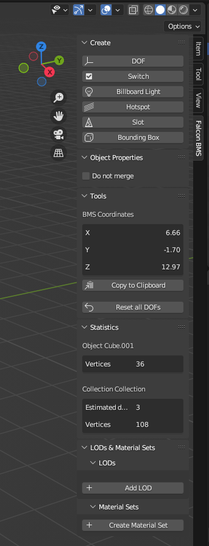

The panel is context-sensitive - selecting a custom BML object (or in the case of DOFs and Switches one of its children) displays its properties panel:

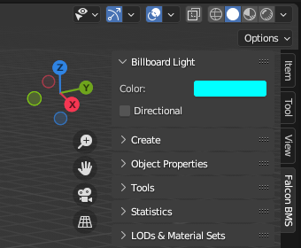
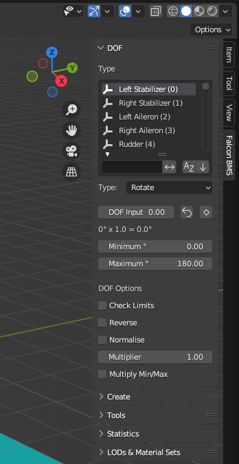

BML objects can also be added using the *Add Menu* (default hotkey ```Shift + a```). Many functionalities of the plugin are wrapped into Blender Operators and can also be accessed from the *Operator Search Menu* (default hotkey ```F3```).


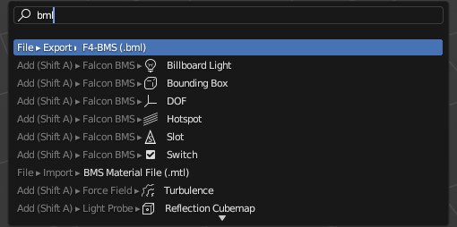

## 5. Materials and Textures
Falcon BMS uses its own material and rendering system. This means that models and their materials are best previewed in the BMS Editor or in game.
Each BMS material contains up to 4 textures. The textures have to be in the DDS format (see [3.2 Structure of a BMS model](#32-structure-of-a-falcon-bms-3d-model)).

### 5.1 Basics
Each Blender material corresponds to a BMS material. If a mesh does not contain any material (slot), a default material is assigned at the export.
Materials are stored in the *Materials.mtl*. This file is mandatory for the model to work, if the file is missing any materials referenced in the model or if the file is absent, the BMS Editor won't launch.

Materials can be configured with the *BMS Material Node Tree*. 

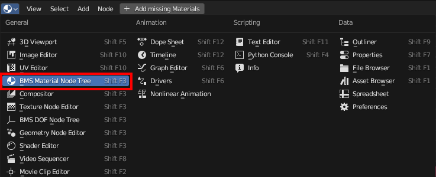

The Material Node Tree is empty by default. If you have already materials in your model, you can add those automatically by clicking *Add missing Materials*.

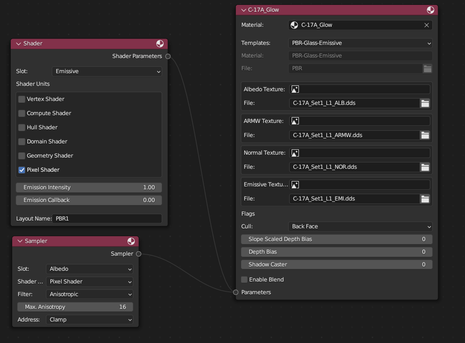

In general, each Material Node is assigned to a Blender Material. Whenever a Blender Material is linked to the Node, its Blender Shading will be configured to incorporate the custom blocks of the BMS materials. This will give a preview of the BMS Materials in Blender.
If an image from the Blender library is set as a texture, it can be exported as a DDS file in the correct format (see [13. Exporting](#13-exporting)).

>⚠️ Each Material name **must be globally unique**. Name your materials accordingly (e.g. with a prefix for your model).

>⚠️ When editing the Shader Nodes of a BMS Material, do not delete the Nodes for the textures - those are required for the export.

>⚠️ The Material preview in Blender is very limited. Changing parameters in the BMS Material Node Tree will have no effect on the model in Blender. 
> Export the Material file and check your work in the BMS Editor. 

For details on how to configure the materials, please refer to the [BMS Wiki](https://wiki.falcon-bms.com/en/tutorials).

### 5.1.1 Importing Material Files and DDS Textures
The plugin also adds the possibility to import whole BMS Material files with File &rarr; Import &rarr; BMS Material File (.mtl). When selecting the option *Import DDS Textures*, the plugin will try to locate the referenced textures and import them to Blender as well.

Single DDS textures can be imported via the menu: File &rarr; Import &rarr; DDS Texture Files (.dds).


### 5.2 Material Sets
BMS supports the creation of Material Sets (sometimes called Texture Sets, Skins, ...) which are used as different liveries for aircraft, etc.

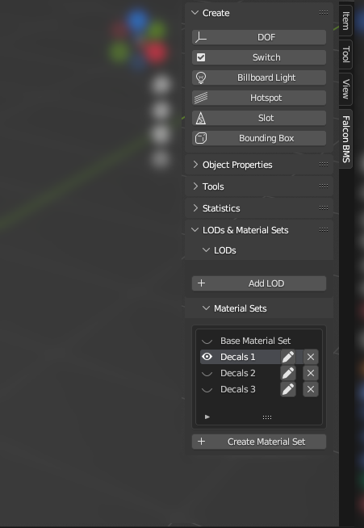

In order to use them, a Material Set has to be created in the Material Sets tool window. If Material Sets are used, a *Base Material Set* is automatically created.
The Base Material Set incorporates all Materials which are the default for a model.

Material Sets work by replacing one or more *Base Materials* from the *Base Material Set* with other Materials. A Material Set can be previewed by selecting it in the *Material Sets* panel.

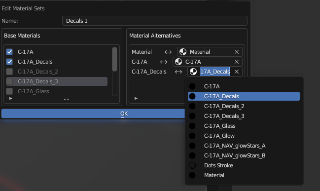

## 6. DOFs
Traditional modeling software uses keyframing and rigging in order to handle animations. Falcon doesn't use these methods, but it uses DOFs (Degrees of Freedom). 
DOFs are animation controllers, to which the visual model is parented in order to represent movement of flight controls, landing gear, flaps etc.
Each DOF is assigned to a *DOF Number* which serves as an identifier and is set by the BMS internal code.
It is possible for multiple DOF objects to have an identical DOF Number. Those objects will be updated at the same time.
Those objects can have different DOF types, Render Controls and settings.

DOFs will only affect geometry that is parented to them.


#### 6.1. DOF Types
Three types of DOFs complete all the needed movement types:
- *Rotate* for a rotation around the DOFs position as a pivot point
- *Translate* for a translation according to the X/Y/Z matrix. The position of the DOF object is not relevant for this type.
- *Scale* - scales the DOFs child meshes according to the DOFs position as origin.

DOFs can be nested into each other in order to get more complex animations
DOFs can be intertwined in order to make more complex animations, such as gear door linkages for example. This is done using Render Controls, explained in section 9 of this manual.

#### 6.2. Configuring DOF Properties
DOFs are configured in the DOF subpanel.

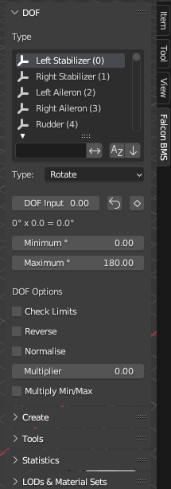

- DOF Input - A preview input to show DOF action.
- X/Y/Z -  *(for Translate and Scale DOFs)* Sets the relative effect of the DOF in each axis.
- Minimum - Minimum input limit for DOF (only works with 'Check Limits')
- Maximum - Maximum input limit for DOF (only works with 'Check Limits')
- Check Limits - Enables maximum and minimum limits for DOF.
- Reverse - Reverses the direction of movement of the DOF.
- Normalize - Adapts the DOF movement in such a way, that an input of 0 equals the DOFs minimum and an input of 1 equals the DOFs maximum. If minimum and maximum are equal, the DOF will always be set to 0.
- Multiplier - Multiplies the DOF input. this is in order to change speed of movement in Falcon.
- Multiply Min/Max - Uses Multiplier value to change the Minimum and Maximum limits of the DOF.

#### 6.3. Custom Gizmos
All DOF types have an interactive gizmo shown in the 3D Viewport when selected.

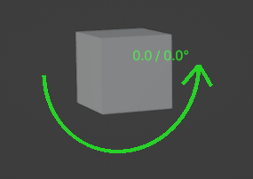

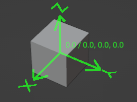

Hovering the mouse over the gizmo and dragging left and right will change the 'DOF Input' consequently showing the movement action of the DOF. 
At all times that the 'DOF Input' is within the min/max limits, or no limits are set, it will show in green. if the 'DOF Input' is outside of Min/Max limits, the gizmo will show in red to indicate it is out of the movement range.

#### 6.4. Keyframing DOFs
The DOF Input can be used for Keyframes to preview animations. To keyframe the DOF Input, select the DOF and click on the Button next to the DOF Input. This is necessary, because Blender can not autodetect Keyframes of custom properties.
After the DOF Input was keyframed for the first time, the remaining Keyframes for the same DOF can be created as usual.

> ℹ️ DOF Keyframes can only be used to preview DOFs. DOFs still need to configured as described in the previous sections. Keyframing DOFs does not have any impact on the DOFs in BMS.


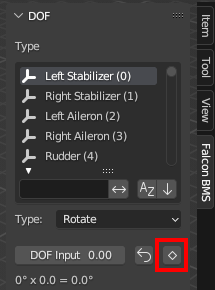

## 7. Switches
Switches act as on/off toggles to show/hide geometry as desired. All current switch values are determined by the logic of the BMS engine. 
They are used for things like cockpit switches (show/hide primitives in different positions), lights, etc.  Switches will only affect geometry that is parented to them.

Switches are represented as an *Empty* in Blender. It is advised to not add geometry directly to the switch object.

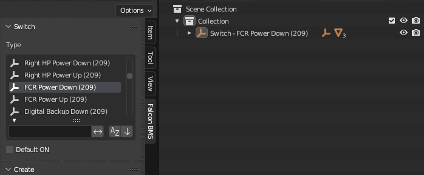

Each Switch has the following properties
- Switch Type - Select the desired switch index.
- Normally On - Inverts the operation of the switch. when enabled, geometry will show when switch value is 0.

> ℹ️ Switch branches are displayed as separate Switch entries in Blender. 


## 8. Billboard Lights
With the introduction of the .BML file format, a new BBL (BML Billboard Light) has been added to Falcon modelers' toolset. These types of lights are used for Aircraft lighting, runway lighting and more.
As the lights are rendered as a billboards - meaning they will always face the viewpoint in 3D Space, the orientation of the plane in blender would not matter - unless the *Directional* flag is used.
It is important to note that the billboard lights do not emit light on PBR Objects.

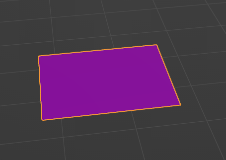

The BBL will be represented as a plane in blender. The BBL size is determined by the size of the plane.

The properties of each light are:
- Color - Change the light's color using a color wheel
- Directional - When enabled, makes the light show only when front side of the plane geometry is in view.

If no material is defined, the light will use the default BML PBR material. Alternatively, a custom alpha channel texture can be used as a BML Material.
The position of the light effect can be changed by changing the UV coordinates of the BBL plane.

> ℹ️ To place many lights at once, Blender modifiers such as *Array* can be used.
 

> ℹ️ On export, lights of the same color will be joined together. This is done to minimize the number of draw calls. In Falcon 3D view, if 2 light points overlap in screen space, it may look as if one of the lights is being blocked by the other. This is because lights are rendered by their Index order, on top of each other.


## 9. Cockpit Hotspots
Hotspots are used to create clickable areas in cockpits. Each *Hotspot* can have one or more *Callbacks* assigned to it.
Hotspots are represented as Blender Empties with a custom image which should be centered on the button primitive.

> ⚠️ The actual size of a BMS Hotspot is determined by the *Size* property, not by the Blender dimensions of the 2d Empty.
> Recommended sizes are 15 (very small buttons) to 45 (F-16 seat ejection handle). It is suggested to refer to an existing 3dButtons.dat.

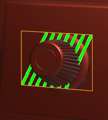

A *Callback* consists of a name which triggers a behaviour in the BMS code (e.g. the SIMHUDBrightnessUp will trigger an increase in the HUD brightness). Each callback is triggered by a mouse button (left, center, right) and plays a sound in BMS.

Callbacks can be either *Toggle Switches* (holds its distinctive state, e.g. MASTER ARM), *Push Buttons* (needs to be pressed and held, e.g. FLCS RESET) or *Wheels* (like Toggle Switches but with increase/decrease functionality, e.g. the INS knob).

For certain cockpit elements, multiple Hotspots are combined. For example, the F-16 ICP switch for DRIFT C/O, NORM, WARN RESET actually consists of two Hotspots: one a bit higher up with the callbacks *SimDriftCOOn* and *SimDriftCOOff* for the left and right mouse buttons and a second Hotspot on a slightly lower position with the *SimWarnReset* Callback.


To display a switched/toggled state of a switch in BMS, add a Switch for each state with their matching child primitives. The Hotspot and its Callbacks are only necessary once.

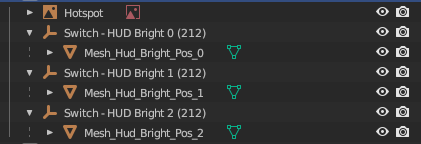

> ℹ️ Instruments, such as needles or the HSI are realized as a structure of Switches (for the background lightning on/off states) and as DOFs which move the display primitive around.  


## 10. Slots
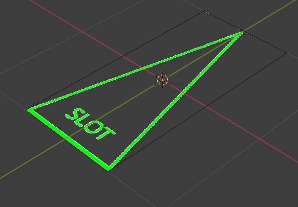

A slot is used to define a point on the model which allows stations or hardpoints to be attached to the model. Each slot has a unique *Slot Number*. and should be oriented with the tip forward.
The data definition of racks is located in the ```BmsRack.dat``` (not part of this Plugin).


## 11. Bounding Box
Falcon uses bounding box dimensions in order to set the objects hitbox.
In order to create a bounding box, Go to the "Add" panel, then "Falcon BMS", then "Bounding Box" (alternatively, you can use the BMS Tools Panel).
A bounding box will be added to the scene and automatically fitted to the geometry of the currently active collection. The bounding box can be moved and scaled.
The bounding box is only required once per scene.

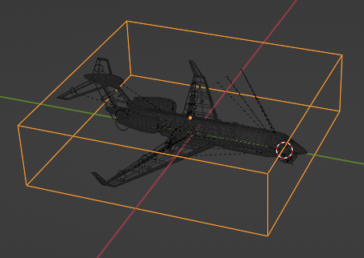

> ⚠️ The bounding box rotation is constrained since Falcon only implements bounding boxes aligned with X/Y/Z Axis. *Do not* force a rotation on the bounding box.

When applying a bounding box to your model, think about how the in-game hitbox should be. i.e. for an aircraft hangar the bounding box should only be the roof, since planes have the option to taxi into them.
The bounding box will be exported into the ```Parent.dat``` file, and will populate the "dimensions" line.

> ℹ️ BMS aircraft can have multiple additional bounding boxes. Those are defined in the \<Aircraft Name\>.dat (ACDATA). Their export is not yet implemented.


## 12. Render Controls
Render Controls are advanced animation controllers that work directly with DOFs. They allow for more complex animations that incorporate 2 or more DOFs moving together, like hydraulic pistons opening doors, landing gear linkages that and so on.

Render Controls are implemented as a node tree, like the Shader Editor, or Geometry Nodes.
They accessed in the 'BMS DOF Node Tree' window.
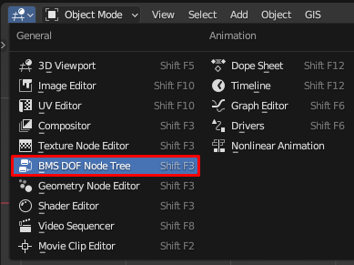

Creating a DOF in the blender scene while the DOF node tree is open, the BMS DOF Node Tree editor will automatically create a new tree called *BMS DOF Node Tree*. Inside of this node tree a node for the new DOF will be automatically created. To automatically add DOF Nodes which are missing, click the *Add missing DOFs* button.

>  ⚠️ Do not create more than one node tree inside the BMS DOF Node Tree Editor window. The exporter will only export the first node tree.

Most Render Control nodes are self-explanatory, basic math functions, trig functions and triangle functions.

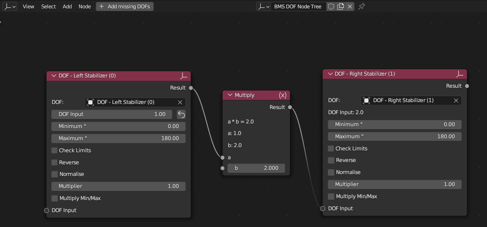

This screenshot shows a very simple RC setup where the DOF for the right stabilizer always receives its value from the DOF of the left stabilizer multiplied by the factor 2.


There are some RC nodes that are BMS specific that will be explained.
- DOF node - Control specific DOF properties, and use the DOF Output to control different nodes.
- Normalize node - remaps an input so that it's output value will be remapped to a range of 0 for its min value and to 1 for its max value.
- Step node - Sets a step size at which the result changes.
- Multiply by FrameTime - Multiplies the input value by SimLibMajorFrameTime. This is the duration, in seconds, between the previous and current frames. Used wherever we need a time step from the last sim update, e.g. for constant and frame-independent speeds.

## 13. Exporting
The BMS Blender Plugin can export a multitude of files. Some of the files are mandatory for a model to load in the BMS Editor.exe, some are optional and might not even be required for certain model types.

| File name(s)          | File Type                               | Used for                                                                                          | Overwrite / Amend contents        | Mandatory for BMS Editor.exe                          |
|-----------------------|-----------------------------------------|---------------------------------------------------------------------------------------------------|-----------------------------------|-------------------------------------------------------|
| *.bml                 | Binary BML (uncompressed or compressed) | Model data                                                                                        | Overwrite                         | Yes                                                   |
| Materials.mtl         | JSON                                    | Materials                                                                                         | Overwrite                         | Yes                                                   |
| *.mti                 | Text                                    | Material Sets                                                                                     | Overwrite                         | No, but can crash the Editor if outdated              |
| Parent.dat            | Text                                    | General model info                                                                                | Overwrite                         | Yes                                                   |
| *.dds                 | DDS Textures                            | PBR Textures                                                                                      | Overwrite                         | Yes, if used in Materials which are used by the model |
| 3dButtons.dat         | Text                                    | Hotspots                                                                                          | Amend                             | No                                                    | 
| \<Aircraft Name\>.dat | Text                                    | ACDATA, containing aircraft data, flight parameters, programmable lights, additional hitboxes ... | ⚠️ Blender export not implemented | No                                                    |


The *Export Dialog* is opened from the menu File &rarr; Export &rarr; F4 BMS (.bml). It allows selecting which files to export.

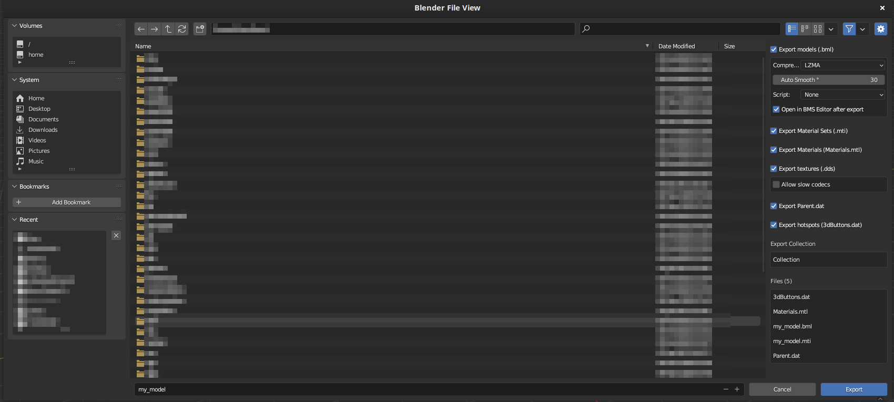

The *Autosmooth* option will be applied to all objects which are joined with objects of the same material.
In general, the export options are self-explanatory. The *Script* is used for special objects (e.g. choppers, the PAPI, etc.).
*Allow slow codecs* allows for the DDS exporter to fall back to CPU codecs if the GPU acceleration can not be used. This might take a very long time (~1 minute / texture) and should be used with caution.

> ℹ️ All export settings are part of the .blend file and will be stored when the file is saved.

> ℹ️ The filename must not contain any spaces. All spaces will be automatically replaced by ``_``.

### 13.1. Exported Objects
The Plugin will export all suitable Objects (Meshes and BML objects) which have their *Render Visibility* set to visible.

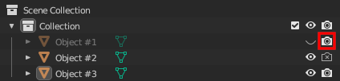

In the screenshot above, Object #1 and Object #3 will be exported. Any objects which do not correspond to BMS internals are ignored.

### 13.2. Automatic Unit Conversion
The default unit for Blender is meters - this is also the unit which is used internally (for scripting, etc.). However, BMS expects all of its measurements in the Imperial system.
The Plugin checks the units of the model upon export and converts them if necessary from Metric to Imperial. No manual scaling is required.

### 13.3. Exporting a Single Collection
By default, the Plugin will export the currently active Blender collection and all of its children. The exported collection's name is displayed in the Export Dialog. 

### 13.4. Exporting LODs
When designing complex models, the usage of LODs (Levels of Detail) will help with keeping BMS performance up. In short, an LOD consists of multiple BML model files.
The designer will specify at which viewing distance each model should be used by the BMS engine. Each LOD consists of a separate .bml and optional .mti file. All LODs share a single Material file.
LODs are not used for cockpits, since the viewing distance will not change to make a difference.

The Blender BMS Plugin will allow the designer to map each LOD to a single collection. The collections are independent of each other, meaning that all necessary meshes, Slots, Switches, DOFs are not shared between the collections.
The only shared structure between the LODs is the Hitbox, but it is expected for all LODs to have identical dimensions.

LODs are configured in the LOD subpanel of the *Falcon BMS* tool panel.

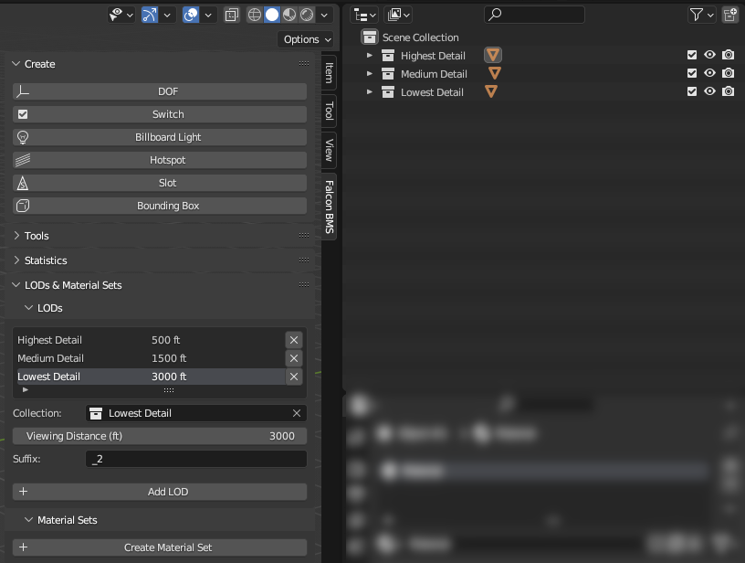

Each LOD is assigned to a single Blender *Collection*. For each Collection, a separate .bml and .mti file will be exported.
The *Viewing Distance* determines when the LOD will be rendered. In the example above, the first LOD is rendered up to 500 ft, the second LOD up to 1500 ft, etc.

The *Suffix* specifies the filename suffix. This is traditionally _1, _2, etc. but can be changed. The suffix must not contain any spaces.

> ℹ️ The Material Sets are identical for all LODs. If a LOD does not contain a Base Material, the corresponding Material Set will not include the Material replacement.

## 14. Troubleshooting & Common Issues

### 14.1 BMS Editor Crashing or not Opening
The most common issue is the BMS ```Editor.exe``` not opening or crashing when loading your model.
If that happens, you can always check the most recent ```_xlog.txt``` and ```_crash.txt``` in your ```<Your Falcon BMS Directory>/User/Logs``` which sometimes gives an indication of the error.

The most common reasons are:
* *Missing files* - make sure that your export includes the files referenced at the beginning of this chapter.
* *Outdated files* - clean your export directory and re-export all of your files.
* *Invalid references* - check your references to other Materials and Templates in the ```Materials.mtl```.

### 14.2 Weird Normals or Triangulation
The Exporter triangulates all meshes using the ``bmesh.ops.triangulate`` operator with the default settings during the export.
This can sometimes lead to unsatisfactory results or strange looking normals in certain parts of a mesh. In that case, add a *Triangulate* modifier to the respective faces.
You don't need to apply it, as all modifiers will be applied automatically before export. This modifier will override the ``bmesh.ops.triangulate`` operator for the selected meshes.

### 14.3 BMS Crashing
If your model works fine in the BMS Editor and displays correctly in the *Tactical Reference* but crashes BMS in 3D, there is most likely a mismatch between the code and your models data files (*Parent.dat*, etc.):
* Check the number of *Slots* of your model
* Make sure you use the latest version of the exporter, especially the ``DOF.xml`` and ``switch.xml``
* Check the ``Parent.dat``. If there is already an older version of a previous model you can reuse, try that one

If you can't find the reason of the BMS crash, please report it with the the relevant ```_xlog.txt```, ```_crash.txt``` and ```_crash.dmp``` from your ```<Your Falcon BMS Directory>/User/Logs```.